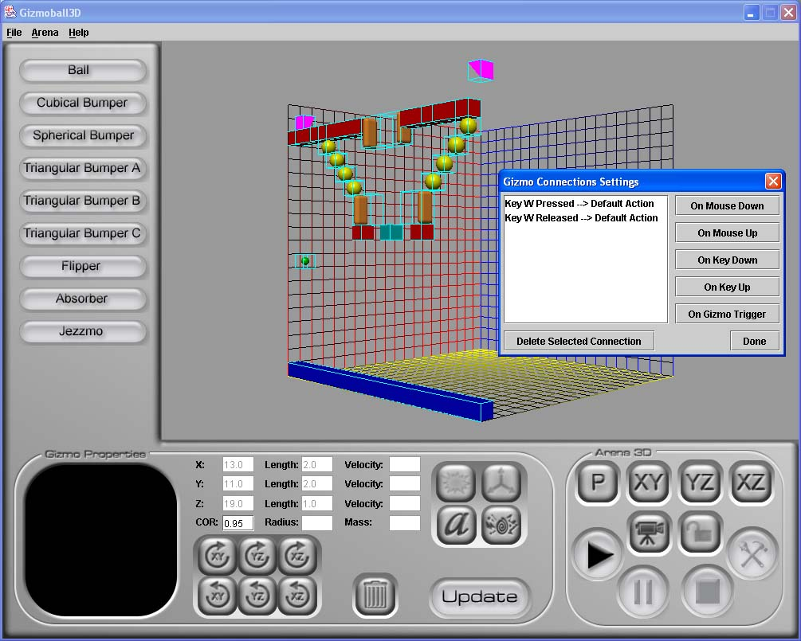

# Gizmoball 3D

## Overview

- Gizmoball 3D is a pinball game made with Java 3D.  The objective is to keep a ball moving around a three-dimensional playing space without falling off the bottom of the map.

- The program includes a game editor, where users can create their own custom game boards, as well as designate specific triggers between game pieces.

- Users may also pause the game at anytime and switch perspectives to view the action of the game from different angles. 

- All games are able to be saved and loaded to local disk.

- The game was built using a proprietary physics engine custom-made for this game.

    

## Installation

Please download and unzip <a href="dist/gizmoball3d.zip">this file</a> from the "/dist" directory and follow the instructions in the "README.txt".

The installation requires the Java JRE runtime and "Java 3D 1.3.1", which is included in the zip file.

## Design and Technical Specifications

You can read the full technical design document at <a href="dist/Gizmoball3D-Final_Design.pdf">this PDF</a> from the "/dist" directory.

## The Team

MIT 6.170 - Laboratory in Software Engineering (Spring 2003) 

Gizmoball 3D was made by "Team se042":

<strong>David Tsai</strong> - 3D Graphics Engine and GUI 
<strong>Eric Tung</strong> - Physics Engine 
<strong>Ragu Vijaykumar</strong> - Backend